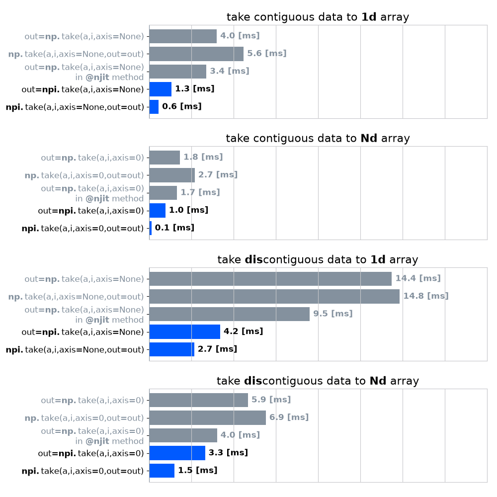

# Npind (numpy-parallel-indexer)

[](https://www.python.org/)
[](https://opensource.org/licenses/MIT)
[](https://semver.org/)

**Npind** is a high-performance Python library engineered to drastically accelerate [NumPy](https://numpy.org/)'s index manipulation routines. 

While contiguous arithmetic operations (e.g., `np.add`) are inherently optimized via hardware SIMD instructions and execute incredibly fast, complex index lookups fundamentally bypass SIMD capabilities. Consequently, indexing operations frequently act as severe single-threaded bottlenecks in NumPy-based data pipelines. Npind was developed specifically to eliminate these bottlenecks and unlock the maximum processing power of the CPU.

Leveraging [Numba](https://numba.pydata.org/)'s multi-threading backend, Npind provides parallelized indexing operations through a clean, NumPy-compatible API. It serves as a seamless drop-in replacement, entirely abstracting away the boilerplate nested `for`-loops often required when writing custom Numba kernels.

## 1. Key Features

- **NumPy-Compatible API**: Inherits NumPy's intuitive interface for seamless integration as a drop-in replacement.
- **Minimal Dependencies**: Pure Python implementation relying strictly on `numpy` and `numba`.
- **Low Overhead Memory Management**: Natively supports in-place operations (via `out` arguments) to rigorously suppress dynamic memory allocations.
- **Laser-Focused on Indexing**: Dedicated exclusively to overcoming the architectural performance limits of array indexing.

## 2. Installation

Install via source:

```bash
git clone https://github.com/ShibanGon/npind.git
cd npind
pip install -e ".[dev]"
```

To uninstall:

```bash
pip uninstall npind
```

## 3. Quick Start

```python
import numpy as np
import npind as npi

a = np.random.rand(10000, 10000)
indices = [0, 500, 999]

# High-performance parallel indexing
result = npi.take(a, indices, axis=1)
```

### 3.1. Benchmarks

Npind significantly outperforms both standard NumPy and naive Numba implementations, demonstrating massive speedups particularly in large-scale data processing. For detailed measurement environments and conditions, please refer to [benchmark.py](https://www.google.com/search?q=./benchmarks/benchmark_take.py).



## 4. Development Roadmap & Status

We are currently expanding the library with multi-threaded implementations of the following routines, meticulously optimizing each with `out` arguments for zero-allocation execution.

[Indexing routines](https://numpy.org/doc/stable/reference/routines.indexing.html)

| Method Name       | Status    |
| ----------------- | --------- |
| `take`            | Completed |
| `take_along_axis` | Completed |
| `choose`          | WIP       |
| `compress`        |           |
| `select`          |           |
| `place`           |           |
| `put`             |           |
| `putmask`         |           |

[Sort, search, and count](https://numpy.org/doc/stable/reference/routines.sort.html)

| Method Name     | Status |
| --------------- | ------ |
| `argsort`       |        |
| `partition`     |        |
| `argpartition`  |        |
| `argwhere`      |        |
| `nonzero`       |        |
| `flatnonzero`   |        |
| `where`         |        |
| `searchsorted`  |        |
| `extract`       |        |
| `count_nonzero` |        |

[Statistics](https://numpy.org/doc/stable/reference/routines.statistics.html)

| Method Name | Status |
| ----------- | ------ |
| `digitize`  |        |

[Indexing on ndarrays](https://numpy.org/doc/stable/user/basics.indexing.html)

| Method Name                 | Status |
| --------------------------- | ------ |
| `numpy.ndarray.__getitem__` |        |

## 5. License

MIT License